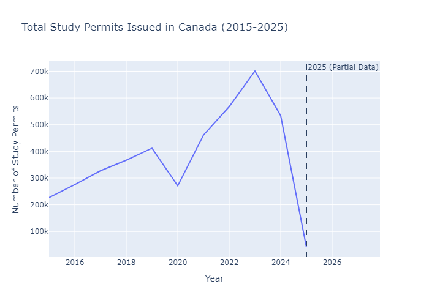
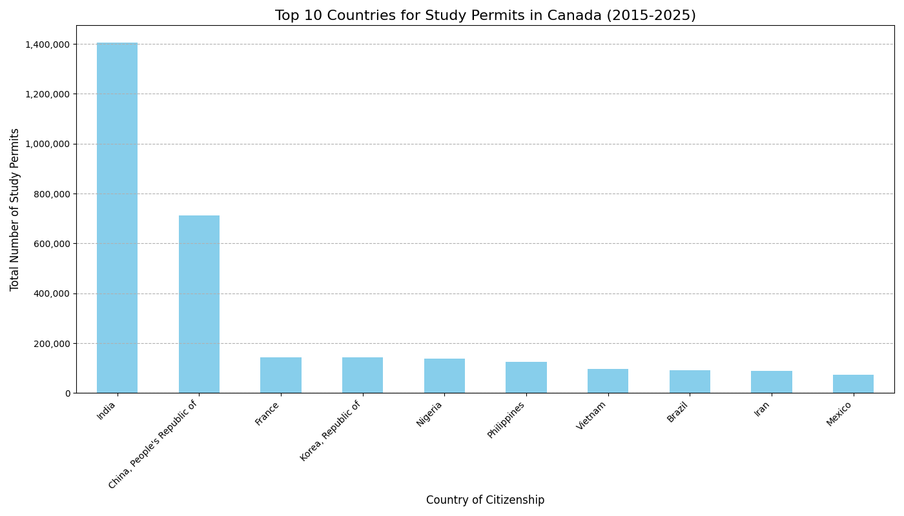
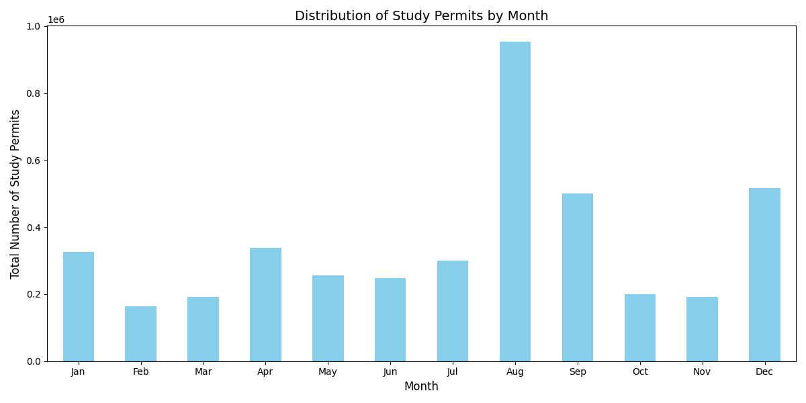
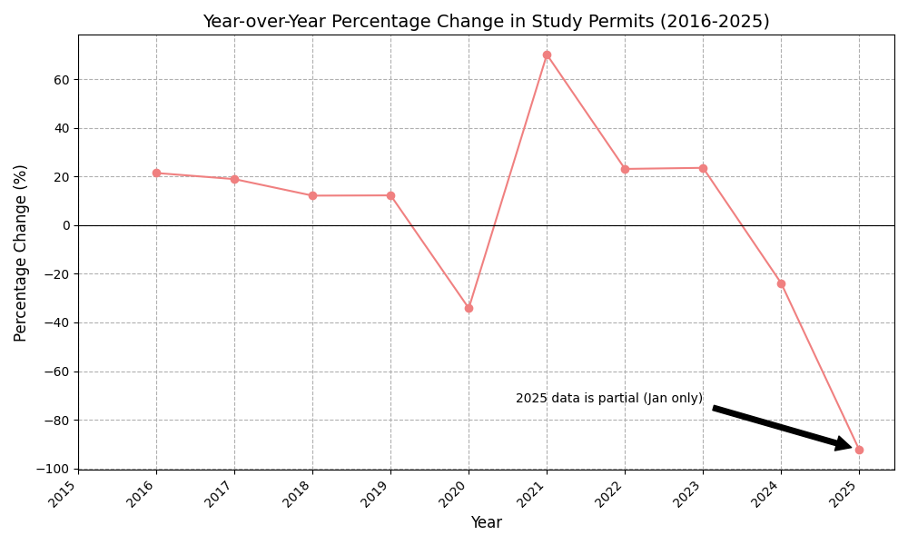
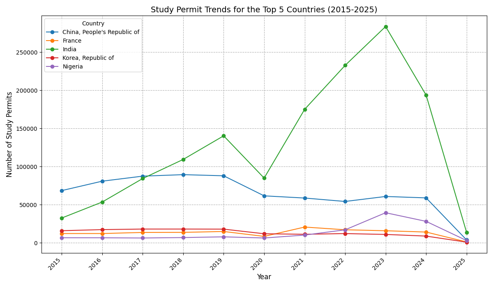

## Study Permit Data Analysis (Canada, 2015-January 2025)

This repository contains a data analysis project focused on understanding trends and patterns in Canadian study permits issued between January 2015 and January 2025. The analysis utilizes monthly data from the Government of Canada's Open Data portal to explore overall permit trends, identify top source countries, examine monthly distribution patterns, and calculate year-over-year percentage changes.

## Data Source

The data used for this analysis was obtained from the Government of Canada's Open Data portal:

[Study permits – Monthly data 2015 to 2024](https://open.canada.ca/data/en/dataset/90115b00-f9b8-49e8-afa3-b4cff8facaee)
**(Note:** The analysis in this repository includes data up to January 2025, as available in the dataset at the time of analysis. The 2025 data currently only includes January statistics and should be interpreted as partial year data.)

## Repository Contents

- `Canada_Study_Permits_Analysis.ipynb`: The Jupyter Notebook containing the complete Python code for data loading, cleaning, transformation, analysis, and visualization, including an interactive plot for yearly trends.
- `study_permits_by_country_2015_2025.xlsx`: The original Excel data file used for the analysis
- `images/`: A folder containing static images of the key visualizations generated in the analysis.
  - `yearly_permits_trend.png`: Line plot showing the total study permits issued per year.
  - `top_10_countries.png`: Bar chart showing the top 10 countries for study permits.
  - `top_5_countries_trends.png`: Line plot showing the study permit trends for the top 5 countries.
  - `monthly_distribution.png`: Bar chart showing the distribution of study permits by month.
  - `yoy_percentage_change.png`: Line plot showing the year-over-year percentage change in study permits.

## Key Findings

- **Overall Trend:** The total number of study permits issued in Canada generally showed an increasing trend between 2015 and 2024, with the available data for January 2025 indicating a continuation of this high volume. This trend is visualized below and is also available as an interactive plot within the notebook, allowing for closer examination of specific years.

  

- **Top Source Countries:** Based on the total number of study permits issued between 2015 and January 2025, the top source countries for study permit applicants to Canada include **India**, **China**, **Nigeria**, **Philippines**, and **France**. The distribution of permits among the top 10 countries is shown below.

  

- **Monthly Distribution:** Study permit issuance appears to peak during the months leading up to the typical academic year starts, with higher numbers generally observed in **August** and **September**. There is also a notable peak in **December**. Permit issuance tends to be lower in **February**, **March**, and **October**, as visualized in the monthly distribution chart below.

  

- **Year-over-Year Change:** The year-over-year percentage change in study permits showed significant growth in **2021** (compared to 2020) and notable fluctuations in other periods, as illustrated in the chart below.

  

- **Top 5 Countries Trends:** The trends in study permit issuance for the top 5 countries over the analysis period are shown in the following plot, highlighting the individual contributions of these key source nations.

  

- **2025 Partial Data:** The data for 2025 is limited to January only. Therefore, any conclusions drawn for the year 2025 based on this analysis are preliminary and do not represent the full annual trend.

**(Note:** Please refer to the Jupyter Notebook for detailed analysis and the interactive plot for the overall yearly trend.)

## How to Run

1.  Clone this repository to your local machine:
    ```bash
    git clone [https://github.com/KhaledAltahrawi/study-permits-analysis.git](https://github.com/KhaledAltahrawi/study-permits-analysis.git)
    ```
2.  Ensure you have Python 3 installed.
3.  Install the necessary libraries if you haven't already:
    ```bash
    pip install pandas matplotlib openpyxl plotly
    ```
4.  Open and run the Jupyter Notebook (`Canada_Study_Permits_Analysis.ipynb`) to reproduce the analysis and visualizations, including the interactive yearly trend plot.

## Contact

Khaled Altahrawi
https://github.com/KhaledAltahrawi
Khaled.tahrawi16@gmail.com

---
