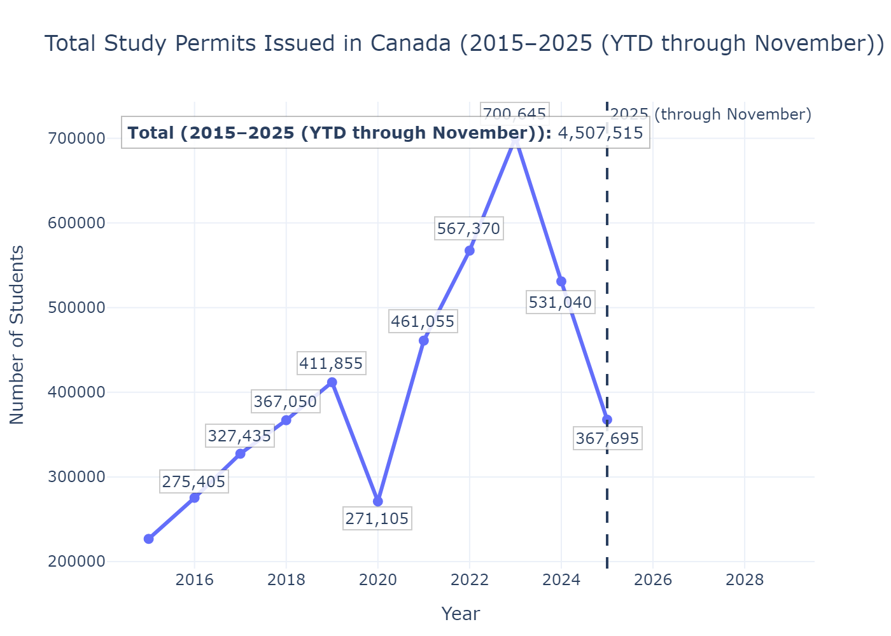
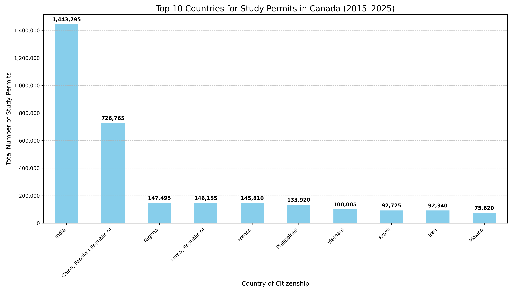
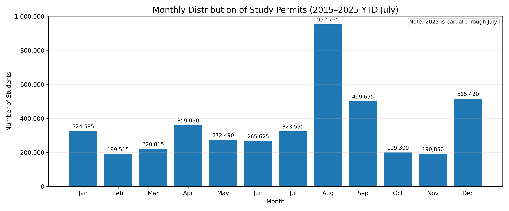
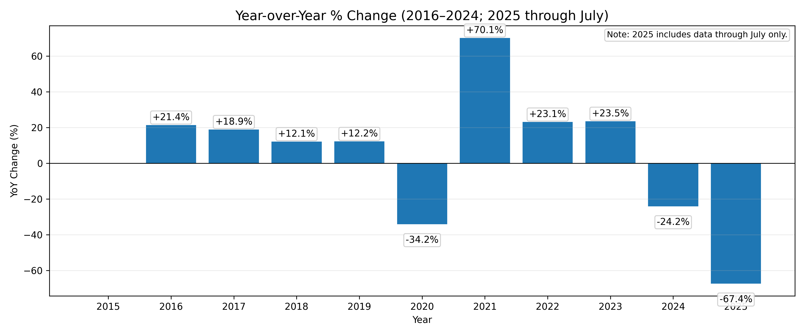
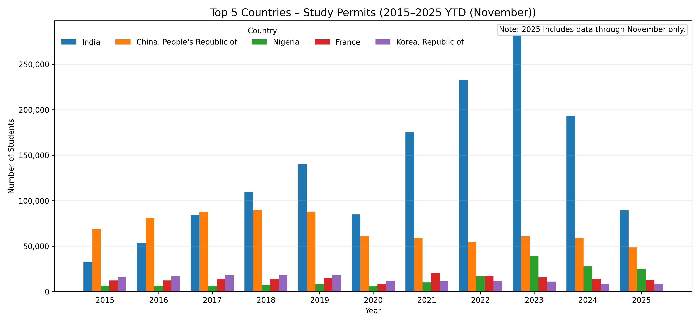

## Study Permit Data Analysis (Canada, 2015–July 2025)

This repository presents an updated data analysis project focused on understanding trends and patterns in **Canadian study permits** issued between **January 2015 and July 2025**.  
The analysis uses monthly data from the Government of Canada's Open Data portal to explore overall study permit trends, identify top source countries, examine monthly distribution patterns, and calculate year-over-year (YoY) percentage changes.

---

## Data Source

The data used in this project was obtained from the Government of Canada's Open Data portal:

📊 [Study permits – Monthly data 2015 to 2025](https://open.canada.ca/data/en/dataset/90115b00-f9b8-49e8-afa3-b4cff8facaee)

> **Note:**  
> The current dataset includes data **through July 2025** only.  
> The 2025 totals should therefore be interpreted as _year-to-date (YTD)_ values.

---

## Repository Contents

- **`Canada_Study_Permits_Analysis.ipynb`** – Main Jupyter Notebook containing all Python code for:
  - Data loading, cleaning, and transformation
  - Exploratory data analysis and visualization
  - Interactive and static visual outputs
- **`study_permits_by_country_2015_2025.xlsx`** – Original Excel dataset used for analysis
- **`images/`** – Static `.png` images generated from the notebook:
  - `yearly_permits_trend.png` – Total study permits per year (2015–July 2025) with smart labels and grand total
  - `top_10_countries.png` – Top 10 countries of citizenship for all permits
  - `top_5_countries_trends_grouped_bars.png` – Grouped bar chart showing YTD trends for top 5 countries
  - `monthly_distribution.png` – Total permits by month across all years (seasonal trend)
  - `ytd_yoy_change.png` – YoY % change (2016–2024 full years, 2025 YTD through July)
- **`reports/`** – Interactive HTML Plotly report for yearly totals (`yearly_permits_trend.html`)
- **`requirements.txt`** – List of Python dependencies
- **`.gitignore`** – Ignores checkpoints, virtual environments, and temporary files

---

## Key Findings

- **Overall Trend:**  
  Study permit issuance in Canada shows a steady upward trend between 2015 and 2024, with 2025 (January–July) data continuing at a high level.  
  

- **Top Source Countries:**  
  The leading source countries between 2015 and July 2025 remain **India**, **China**, **Nigeria**, **Philippines**, and **France**.  
  

- **Monthly Distribution:**  
  Permit issuance peaks around **August–September** (academic intake) and **December**, with dips in **February**, **March**, and **October**.  
  

- **Year-over-Year Change:**  
  The YoY growth chart highlights strong rebounds in 2021 (post-pandemic) and variable growth since, with 2025 included as a _partial-year view (Jan–Jul)_.  
  

- **Top 5 Countries Trends:**  
  Consistent year-over-year growth from major regions, especially India and Nigeria.  
  

---

## How to Run

1. **Clone this repository**

   ```bash
   git clone https://github.com/KhaledAltahrawi/study-permits-analysis.git
   cd study-permits-analysis

   ```

2. **Clone this repository**
   Set up a virtual environment (recommended)

   python -m venv venv
   source venv/bin/activate # on Windows: venv\Scripts\activate

3. **Install required packages**
   pip install -r requirements.txt

4. **Run the Jupyter Notebook**
   jupyter notebook

Then open Canada_Study_Permits_Analysis.ipynb and select Run All.
This will automatically generate the latest charts under /images/ and the interactive report under /reports/.

## Contact

Khaled Altahrawi
https://github.com/KhaledAltahrawi
Khaled.tahrawi16@gmail.com
